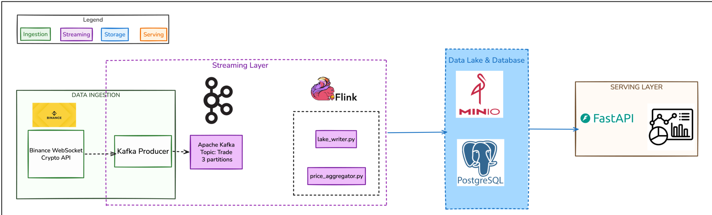
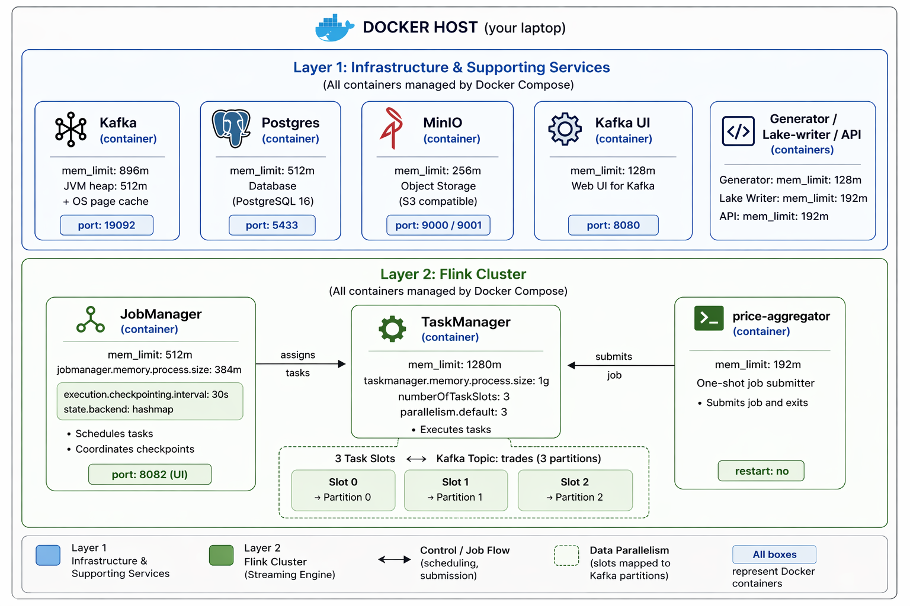
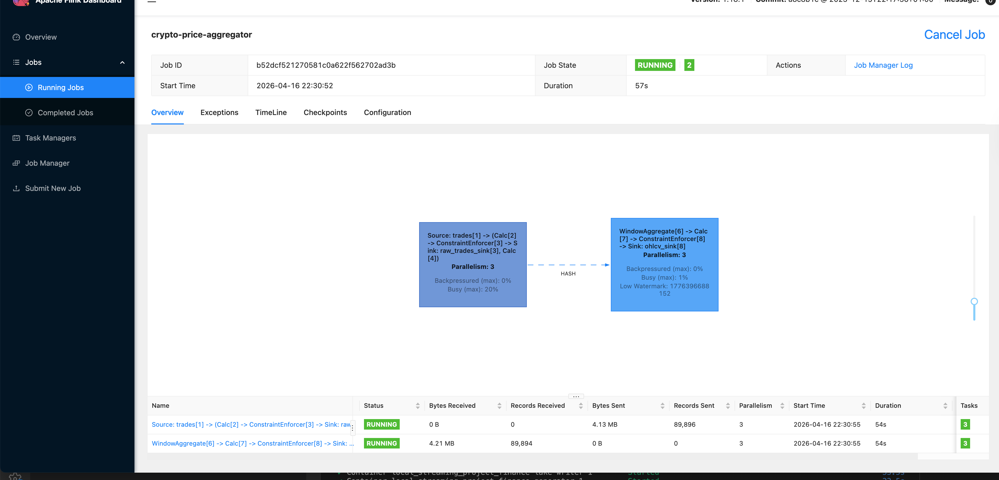
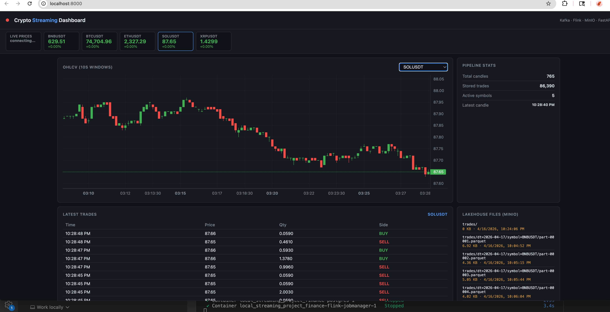
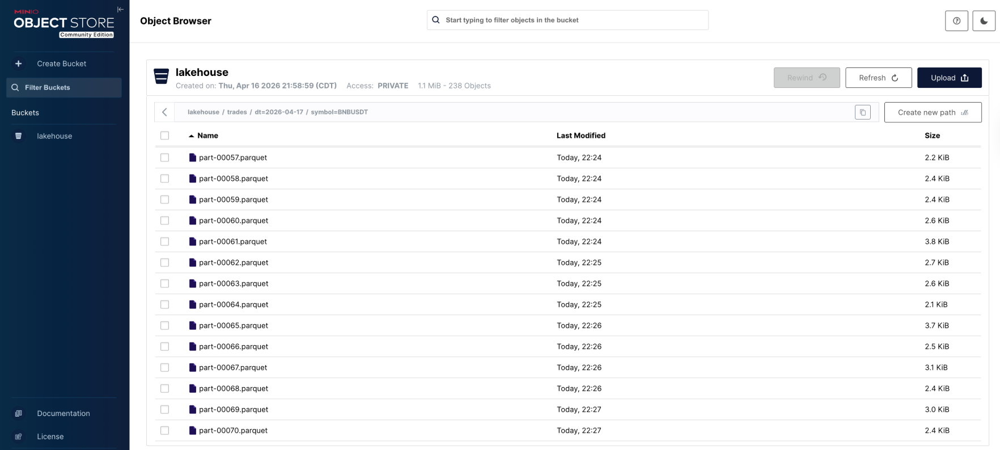

# Crypto Streaming Platform

Clean local streaming architecture using Binance crypto trades API, Kafka, Flink, MinIO, Postgres.

## Architecture



## Run

1. Copy the environment file.

```bash
cp .env.example .env
```

2. Start the full platform.

```bash
COMPOSE_BAKE=true docker compose up -d --build
```
**Note:** The `COMPOSE_BAKE` command is designed to streamline the startup process for containers in complex setups. It optimizes the spin up of containers by ensuring that all necessary containers are started efficiently and in the correct order. This helps to improve the overall performance and reliability of the system.

3. Open the UIs.

- Dashboard: `http://localhost:8000`
- Kafka UI: `http://localhost:8080`
- Flink UI: `http://localhost:8082`
- MinIO Console: `http://localhost:9001`

## Local Resource Profile

This stack is currently tuned for a constrained local Docker budget of roughly `4 GB` total memory.

- Kafka: `mem_limit: 896m`, JVM heap `512m`
- Flink JobManager: `mem_limit: 512m`, `jobmanager.memory.process.size: 384m`
- Flink TaskManager: `mem_limit: 1280m`, `taskmanager.memory.process.size: 1g`
- Postgres: `mem_limit: 512m`
- MinIO: `mem_limit: 256m`
- API: `mem_limit: 192m`
- Generator: `mem_limit: 128m`
- Lake Writer: `mem_limit: 192m`

The goal is local stability rather than peak throughput: keep every service bounded, leave Kafka some room for page cache, and keep Flink's internal memory settings below the container ceiling.

## Expected Output

After startup, the expected steady-state is:

- `generator` is publishing Binance trade events into Kafka
- `price-aggregator` is running as one continuous Flink job
- `lake-writer` is writing Parquet files into MinIO
- the dashboard is reading candles and latest trades from Postgres
- Kafka UI shows the `trades` topic and the `lake-writer` consumer group
- Flink UI shows a running job named `crypto-price-aggregator`

Useful check:

```bash
docker compose ps
```

You should see these services up:

- `kafka`
- `kafka-ui`
- `flink-jobmanager`
- `flink-taskmanager`
- `price-aggregator`
- `generator`
- `lake-writer`
- `postgres`
- `minio`
- `api`

## Screenshots

### Flink runtime after load stabilizes



### Dashboard



### MinIO



## References Docs

- [Architecture ](docs/architecture.md)
